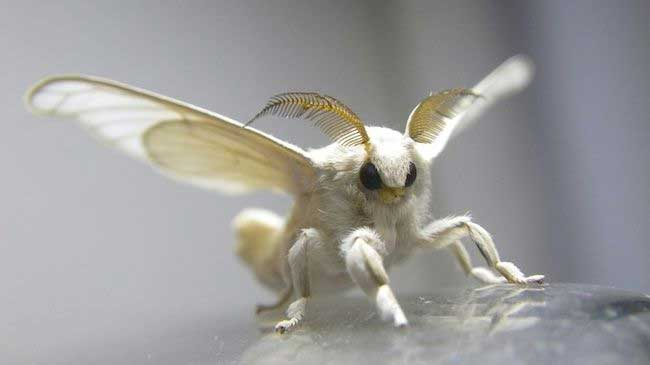

# Vrill (NPC)

#people #npc #ankharel #vermillion-dream

Co-founder of the [[Consortium of the Vermillion Dream]]. Turns into a white moth. Seems to be a very powerful arcane practitioner. Resides in [[Ank'Harel]].

It is the person who transformed themselves into a white moth and followed the party members in Ank'Harel.

## Can she be trusted?

This is the biggest of the questions. Can we actually trust Vrill? Some points  to consider:
- When Herschel asked the Moonweaver for guidance, at her Temple, they received the vision of a white moth as a sign to reach [[Cael Morrow]].
- [[Calinao]] used to host Vrill at the [[Step Aside]], back in the day. Calinao says she knows the Network.